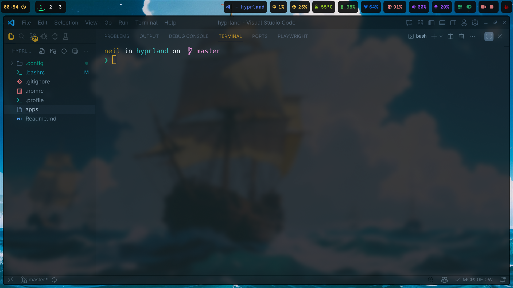
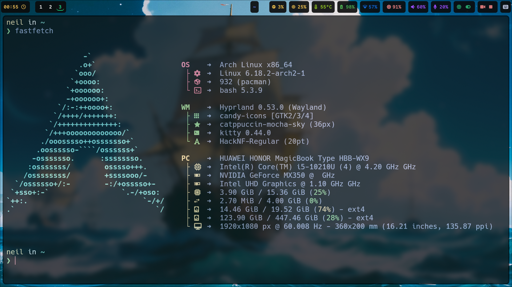
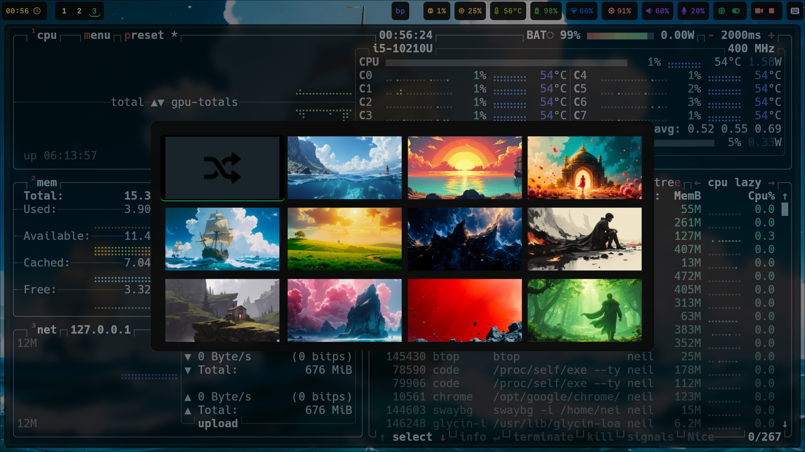

# ArchLinux Hyprland Dotfiles

A comprehensive collection of configuration files for Hyprland Wayland compositor on Arch Linux, designed to provide a highly customized and productive desktop environment.

## 🖼️ Preview



---



---



## 🧠 Knowledge You'll Gain

Using this repository will teach you valuable skills about:

### Wayland Compositors
- Understanding the differences between X11 and Wayland protocols
- Learning how to configure and customize Hyprland, a dynamic tiling Wayland compositor
- Mastering window management concepts like tiling, floating, and pseudotiling layouts

### Shell Scripting & CLI Assembly
- Creating sophisticated bash scripts that integrate multiple command-line tools
- Understanding how to parse JSON output from tools like `hyprctl` and `jq`
- Building interactive menus using tools like `wofi` and `yad`

### System Integration
- Managing systemd user services for persistent background processes
- Configuring input methods (fcitx5) for multilingual support
- Setting up clipboard managers and screen recorders for Wayland

### Configuration Management
- Organizing complex configuration files across multiple tools
- Using modular configuration approaches (like the bashrc modules)
- Understanding how different desktop components interact

## 🔧 CLI Assembly Techniques

This repository demonstrates advanced techniques for combining command-line tools:

### Scripting Examples

#### Screenshot Tool (`~/.config/hypr/scripts/screenshot`)
```bash
#!/bin/bash
FILE="$HOME/Pictures/screenshot_$(date +%Y%m%d_%H%M%S).png"
grim -g "$(slurp)" "$FILE" && imv "$FILE"
```
This script combines:
- `date` for timestamp generation
- `slurp` for interactive region selection
- `grim` for Wayland-native screenshot capture
- `imv` for image viewing

#### Window Switcher (`~/.config/hypr/scripts/switch`)
This complex script demonstrates:
- JSON parsing with `jq` to extract window information from `hyprctl`
- String manipulation to normalize application names
- Integration with `wofi` for GUI selection
- Advanced window management using `hyprctl` commands

#### Keybinds Viewer (`~/.config/hypr/scripts/binds`)
Features:
- Dependency checking for required tools
- JSON processing to format keybinding information
- Interactive GUI display using `yad`
- Recursive refresh functionality

### Modular Configuration Architecture

The bashrc configuration uses a modular approach:
```bash
export BASHRC_DIR="$HOME/.config/bashrc"
export BASHRC_EXT=".bash"

source_module() {
    local module="${1}"
    if [[ -f "${BASHRC_DIR}/${module}${BASHRC_EXT}" ]]; then
        source "${BASHRC_DIR}/${module}${BASHRC_EXT}"
    else
        echo "Warning: Module ${module} not found" >&2
    fi
}

source_module "env"
source_module "paths"
source_module "alias"
source_module "functions"
```

This technique allows for:
- Separation of concerns in configuration files
- Easy maintenance and updates
- Selective loading of components

## 🛠️ Tools & Configurations Included

### Core Components
- **Hyprland**: Dynamic tiling Wayland compositor
- **Waybar**: Highly customizable Wayland bar
- **Mako**: Notification daemon
- **Wofi**: Application launcher and runner
- **Wlogout**: Logout menu
- **Swaylock**: Screen locker

### Terminals & Shells
- **Kitty**: GPU-accelerated terminal emulator
- **Foot**: Fast Wayland terminal
- **Zsh**: Interactive shell with Oh My Zsh
- **Starship**: Cross-shell prompt

### File Managers & Browsers
- **Yazi**: Blazing fast terminal file manager
- **Joshuto**: Ranger-inspired file manager
- **Qutebrowser**: Keyboard-driven browser
- **Thunar**: Modern file manager

### Media & Utilities
- **MPV**: Media player
- **Imv**: Image viewer
- **Cava**: Audio visualizer
- **Neofetch**: System information tool
- **Fastfetch**: Fast system information tool
- **Btop**: Resource monitor

### Development Tools
- **Git**: Version control system
- **Node.js/NPM**: JavaScript runtime and package manager
- **Python**: Programming language with pip
- **Rust**: Systems programming language

### Input Methods & Accessibility
- **Fcitx5**: Input method framework with Rime engine
- **GSettings**: GNOME settings daemon

## 📦 Package List

The `apps` file contains a comprehensive list of packages used in this setup, including:
- Base system packages
- Desktop environment components
- Development tools
- Multimedia applications
- Utilities and helpers

## 🚀 Installation

1. Clone this repository:
   ```bash
   git clone https://github.com/yourusername/hyprland-dotfiles.git
   ```

2. Backup your existing configuration:
   ```bash
   mv ~/.config/hypr ~/.config/hypr.backup
   mv ~/.bashrc ~/.bashrc.backup
   ```

3. Copy the configuration files:
   ```bash
   cp -r .config/hypr ~/.config/
   cp .bashrc ~/
   ```

4. Install required packages (using the list in the `apps` file)

5. Reboot or start Hyprland session

## 🎯 Key Features

### Smart Window Management
- Automatic workspace assignment for specific applications
- Pseudotiling for flexible window arrangements
- Window opacity and transparency controls

### Productivity Shortcuts
- Super+D: Minimize active window
- Super+E: Open file manager
- Super+M: Open music player
- Super+B: Open system monitor
- Alt+Tab: Switch between applications
- Super+Space: Launch applications

### Custom Scripts
- `screenshot`: Interactive screenshot tool
- `record-screen`: Screen recording functionality
- `switch`: Advanced window switching
- `binds`: View all keybindings in a GUI
- `wall`: Wallpaper management
- `opacity`: Adjust window opacity

### Visual Customization
- Blur effects and transparency
- Rounded corners
- Custom themes and cursors
- Animated transitions

## 🤝 Contributing

Feel free to fork this repository and submit pull requests for improvements. Issues and suggestions are welcome!

## 📜 License

This project is licensed under the MIT License - see the LICENSE file for details.